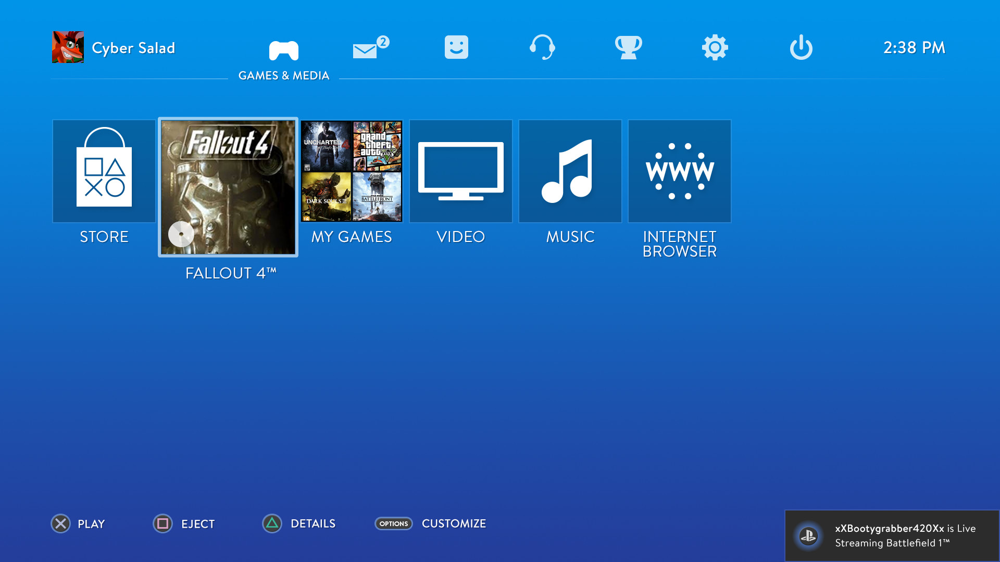

# 20262-team-9

## Simulador de Sistema de Console de Videogames
O projeto consiste no desenvolvimento de um sistema que simula a experiência de utilização de um console de videogame, contendo uma interface inspirada nos sistemas de consoles modernos, permitindo ao usuário navegar por menus, acessar uma biblioteca de jogos, visualizar informações sobre os jogos e gerenciar diferentes funcionalidades do sistema.
O objetivo é reproduzir, de forma simplificada, a experiência proporcionada pelo sistema de um console, sem a necessidade de desenvolver ou simular o hardware do videogame.
O projeto terá como foco a criação da interface, a organização das funcionalidades e a interação do usuário com o sistema.

## Funcionalidades
O sistema deverá simular o funcionamento de uma plataforma de console de videogame, disponibilizando funcionalidades relacionadas à administração de jogos, usuários, loja, armazenamento, interação social e personalização, como:

-Perfis: criação de múltiplos perfis de jogador e desenvolvedor.
-Biblioteca: gerenciamento dos jogos adquiridos, jogáveis e não jogáveis, incluindo armazenamento e espaço disponível.
-Loja: catálogo de jogos organizado por gêneros, com compra, preços e avaliações.
-Saldo: gerenciamento e adição de saldo para aquisição de jogos.
-Personalização: customização da interface e temas do sistema.
-Social: sistema de amigos, convites e eventos/notificações sobre atividades dos jogadores.
-Troféus: conquistas, visualização e ranking de troféus entre jogadores.
-Recomendação: sugestões de jogos baseadas nos gêneros favoritos do usuário.
-Desenvolvedores: cadastro de jogos e gerenciamento de informações, preços e tamanho dos jogos.
-Modos de execução: modo Interativo, com interface gráfica, e modo Headless, executado sem interface.

Veja um exemplo de Launcher semelhante(Imagem é meramente ilustrativa).

## Diagrama de Classes

