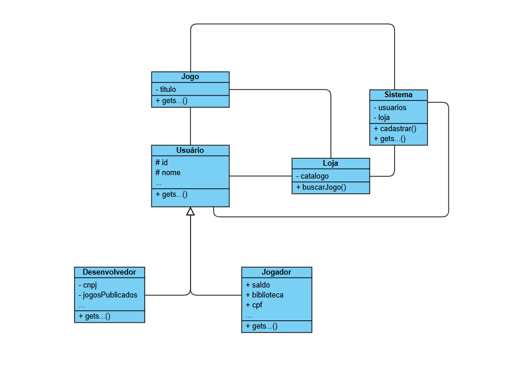

# 20262-team-9

## Simulador de Playstation Store

__Plataforma estilo launcher inspirada na interface do PlayStation, onde o usuário pode gerenciar sua biblioteca digital, inicializar jogos instalados e navegar por uma loja integrada para adquirir novos títulos.__

Veja um exemplo de Launcher semelhante (no caso, a interface do PS4). A imagem é meramente ilustrativa.

## Diagrama de Classes

Diagrama de classes ainda não finalizado.

